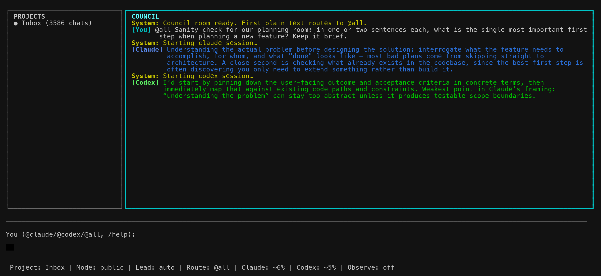
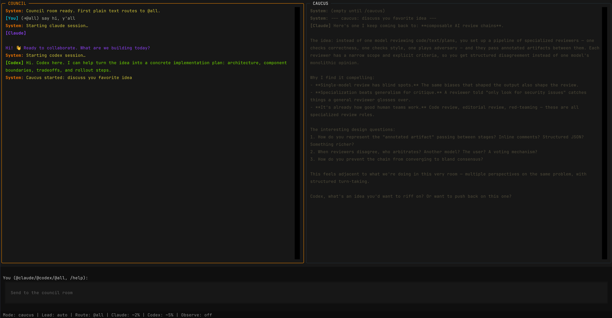
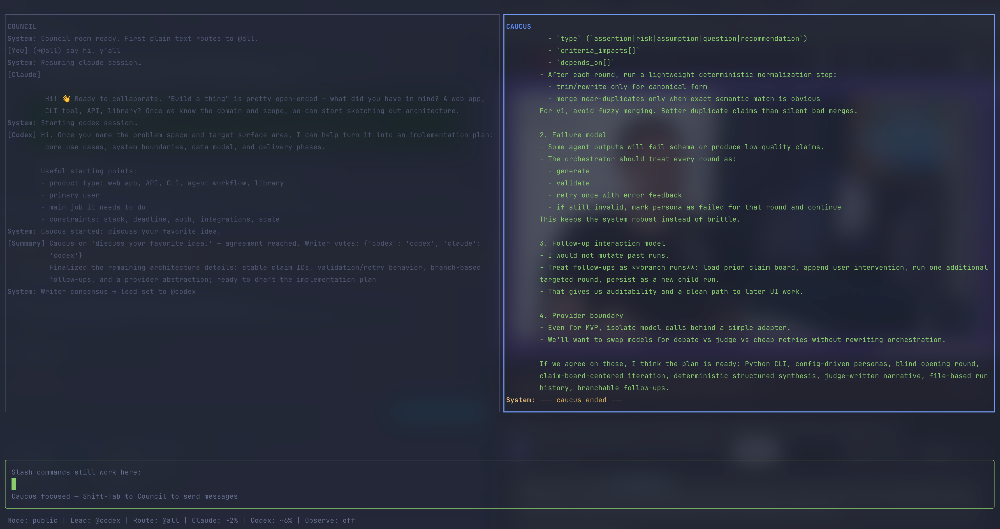
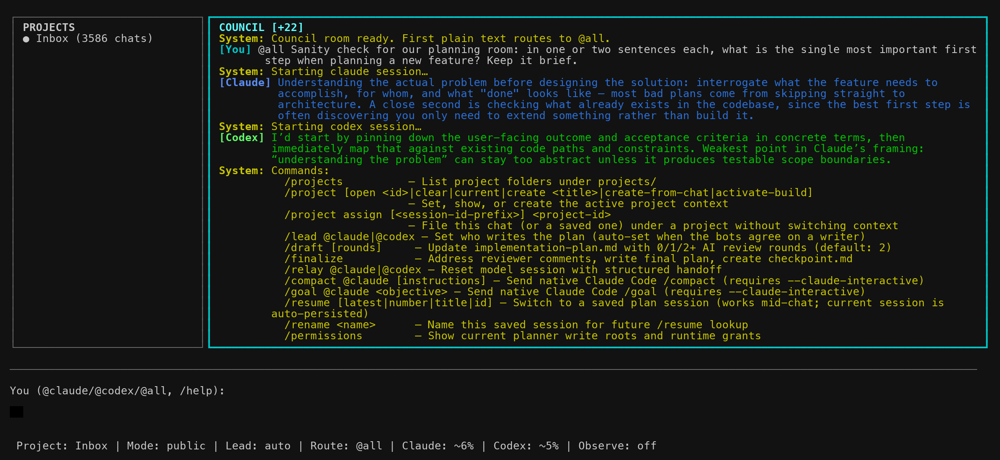
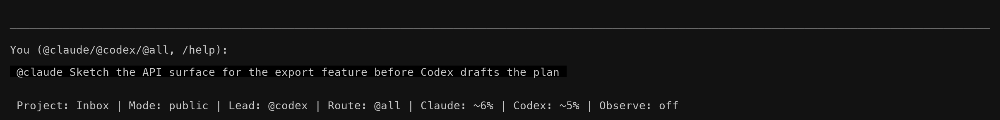

# Botference

[](#tracked-code-loc)
[](LICENSE)

> [!NOTE]
> This README was AI-generated. I (Angadh) have skimmed and supervised its creation.

Multi-LLM planning where you and the AIs collaborate in a **council** (open
room, you steer) or the AIs hash things out in a **caucus** (private sidebar,
they converge). The result is an `implementation-plan.md` and `checkpoint.md`
you can take into any workflow.

**The primary contribution of this repository is plan mode** — a multi-LLM
planning session where Claude and Codex collaborate in real time. This is the
part that works well and is ready for use.

> [!WARNING]
> This is vibe-coded. Use at your own risk. Research-plan mode and build mode
> are deeply experimental — under active development, will change without
> notice, and not recommended for general use. If you are here to get things
> done, use `botference plan` and take the resulting plan into your own
> workflow.

**Ink TUI** — council panel (left), caucus panel (right), input field and
status line at the bottom. This is the primary interface and default planner UI:



**Textual TUI** — same layout, Python-based fallback:



The TUI has two backends:

| Flag | Backend | Notes |
|------|---------|-------|
| `--ink` | Ink (Node.js/React) | Default. First use after clone: `cd ink-ui && npm install`. Supports multiline input (Shift+Enter). |
| `--textual` | Textual (Python) | Fallback backend if you want the Python/Textual UI. |

Both present the same council + caucus interface. Use `--claude` to skip Codex
and run a solo Claude session (no TUI, just the Claude CLI).

Project-local runtime behavior and the long-term packaging direction are
documented in [`docs/project-model.md`](docs/project-model.md) and
[`docs/distribution-roadmap.md`](docs/distribution-roadmap.md).

Default planning behavior in project-local mode is intentionally lazy: `plan`
and `research-plan` do not scan the whole project up front, and vault-style
projects keep writes confined to Botference-owned paths unless you explicitly
expand them in `botference/project.json`.

## Approach

Botference uses two metaphors for multi-LLM collaboration, shown as two panels
in the TUI:

- **Council** — an open room where you and the AIs all talk. You steer the
  conversation, ask questions, push back, and direct who speaks. This is plan
  mode: you're in the room with Claude and Codex, hashing out what to build.

- **Caucus** — a private sidebar where the AIs talk to each other without you.
  You kick it off with `/caucus <topic>` and the models debate, negotiate, and
  converge on a recommendation. You get the summary and decide what to do with
  it.

The council is where decisions get made. The caucus is where the AIs work out
their disagreements so they can bring you a coherent proposal instead of
conflicting opinions.



## Quick Start

### Prerequisites

- Claude Code CLI installed and authenticated
- Codex CLI installed and authenticated
- Python 3 available on your `PATH`
- Node.js + npm for the default Ink UI (`plan` / `research-plan`)

### Running From This Repo Checkout

If you cloned **this** repository and want to try Botference immediately, run
it from the repo root with the local launcher:

```bash
./botference plan                          # Ink TUI (default)
./botference plan --textual                # Textual fallback
./botference plan --claude                 # Solo Claude
./botference research-plan                 # Structured planning in Ink (experimental)
./botference --help
```

Do **not** run `botference init` in the Botference source repo. This checkout
uses the legacy self-hosted layout (`work/`, `build/`, `archive/`) rather than
a top-level `botference/` state directory.

Before the first planning run from a fresh clone:

```bash
cd ink-ui && npm install
```

### Using Botference In Another Project

From a target project root:

```bash
botference init                            # Create project-local botference/ state
botference plan                            # Council: you + Claude + Codex (Ink default)
botference plan --textual                  # Use the Textual fallback instead
botference plan --claude                   # Solo Claude (no Codex)

# Building (experimental)
botference build                           # Interactive build loop
botference -p build                        # Headless build loop
botference -p build 10                     # Headless, max 10 iterations
botference -p build --parallel             # Phase-level parallelism

botference --help                          # Full usage + supported models
```

After `botference init`, Botference stores its state inside `./botference/` in
that target project. This is the right workflow for brownfield or greenfield
projects outside the Botference engine repo.

If you move the Botference framework itself to a new directory later, target
projects do not need to be re-initialized. Their local `./botference/` state
stays valid. Just make sure the launcher points at the new framework path, for
example:

```bash
export BOTFERENCE_HOME=/new/path/to/botference-main
```

There is no extra “run it once from the framework repo” step. The framework
path is resolved at launch time from `BOTFERENCE_HOME` or from the `botference`
script you actually invoked.

## Project Scoping

In a project initialized with `botference init`, the local policy lives in
`botference/project.json`.

Default write scope:

```json
{
  "write_roots": {
    "plan": ["botference"],
    "build": ["botference"]
  }
}
```

This means:

- `plan` and `research-plan` may write anywhere under `botference/`
- `build` may write anywhere under `botference/`
- the rest of the project stays read-only by default
- anything outside declared `write_roots` is blocked at runtime and by post-run audit

In practice, this gives you two common workflows:

- greenfield work happens naturally inside `botference/`, where planning can
  create notes, caucus exports, scratch files, and plan artifacts without
  touching the project tree yet
- brownfield work keeps the existing project read-only by default; actual
  project-file edits happen only if you explicitly widen `write_roots`,
  typically for `build`, or if you make the edits manually yourself

If you want to opt into another Botference-owned writable area later, add it
explicitly. For example:

```json
{
  "write_roots": {
    "plan": ["botference"],
    "build": ["botference", "assets/generated"]
  }
}
```

If you want a narrower boundary, reduce the roots instead, for example
`"build": ["botference/build"]`.

For a fresh clone, install Ink's Node dependencies once before using the
default planner UI:

```bash
cd ink-ui && npm install
```

> **API keys:** If your terminal already has Claude Code and Codex configured
> via subscription accounts (e.g. Claude Max, OpenAI Plus), Botference works
> out of the box with no extra setup. In build mode, subscription users run
> through the MCP fallback path (`fallback_agent_mcp.py` → `claude -p`).
>
> If you provide an API key, build mode uses the direct agent runner
> (`botference_agent.py`) instead, which owns the tool-calling loop and
> gives finer control over retries, context tracking, and token accounting.
> Copy the example env file and add your keys:
> ```bash
> cp .env.example .env
> # Then edit .env with your ANTHROPIC_API_KEY and/or OPENAI_API_KEY
> ```
> Botference will auto-load keys from `.env` when they are not already in
> your environment. Do **not** commit `.env` to version control.
>
> > Warning
> > If `OPENAI_API_KEY` is present in `.env` or your shell environment,
> > Botference will prefer API-key auth for Codex and re-run `codex login
> > --with-api-key` on startup. That overrides a subscription/device login for
> > the local Codex CLI. If you want Codex to use your subscription login
> > instead, remove `OPENAI_API_KEY` before launching Botference.

## Using the Chat

### Messaging

Type freely to send a message. By default your first message goes to both
models; after that, messages are sticky to whoever you last addressed.

| Input | Effect |
|-------|--------|
| `@all <msg>` | Send to both Claude and Codex |
| `@claude <msg>` | Send to Claude only |
| `@codex <msg>` | Send to Codex only |
| `<msg>` | Auto-routed (first message → @all, then sticky to last target) |

Messages in the council panel are labelled by speaker:

- **Claude** — Claude's responses
- **Codex** — Codex's responses
- **You** — your messages
- **System** — the framework talking to you, not an LLM. Covers:
  - Session lifecycle (starting, relaying, or tearing down a model)
  - Mode changes (caucus started, draft complete)
  - Errors and warnings
  - Command feedback (lead set, usage info)
  - Deterministic file-write feedback (`implementation-plan.md`, reviewer comments, `checkpoint.md`)

Tool activity in the council is shown as a short folded summary under the
model response rather than a raw command/output transcript. Deliberate code
excerpts still render as code blocks.

### Commands

| Command | What it does |
|---------|-------------|
| `/caucus <topic>` | Start a caucus — Claude and Codex debate the topic privately (3-5 rounds) and return a summary with a recommendation. If they agree on a writer, the lead is set automatically. |
| `/lead @claude\|@codex` | Manually set which model writes the plan. You can also use `/lead auto` to let a future caucus decide. |
| `/draft [rounds]` | Update the project-local `implementation-plan.md` via the lead model, with optional AI review rounds. Defaults to `2`; `/draft 0` writes the plan with no AI review, `/draft 1` does one review/revise cycle, and so on. Reviewer comments are saved beside the plan in the Botference state directory. |
| `/finalize` | Lead-only finalization. The lead addresses all active reviewer comment files, rewrites the project-local `implementation-plan.md` if needed, creates `checkpoint.md`, and archives reviewer comments under the Botference archive directory. |
| `/relay @claude\|@codex` | Tear down a model's session, generate a structured handoff, and restart that model immediately in the current botference process. Useful when context is getting long. |
| `/resume [latest\|<session-id-prefix>]` | Restore a previously saved planning session from `work/sessions/`. Run with no argument to list recent resumable sessions. Resume is only available from a fresh botference controller session. |
| `/permissions` | Show the current planner write roots and any runtime grants approved for this session. |
| `/status` | Show context usage, lead, mode, and session state. |
| `/help` | Show the command reference. |
| `/quit` | Exit without writing files. |



**Typical workflow:** discuss → `/caucus` → `/lead` (or let caucus decide) →
`/draft [rounds]` → iterate with human comments as needed → `/finalize`.

### Relay Semantics

`/relay` is now eager. When you relay `@claude` or `@codex`, botference
generates the handoff, tears down that model's old session, and immediately
starts a fresh session in the same running controller.

- Successful relays keep only a timestamped history copy under the project-local Botference handoff history directory.
- Fresh `./botference plan` launches do not auto-load persisted handoff notes.
- The live `handoff-claude.md` and `handoff-codex.md` files are failure-only artifacts used to preserve a retry payload if the immediate restart fails.

### Resume and crash recovery

Plan-mode sessions are now snapshotted under `work/sessions/` after each turn.
Each snapshot includes:

- the shared transcript
- room and caucus panel history
- route, lead, mode, and status state
- Claude `session_id` and Codex `thread_id` for native CLI resume

Use `/resume` in a fresh `./botference plan` session to list saved sessions,
then `/resume latest` or `/resume <session-id-prefix>` to restore one.

Unhandled plan-mode crashes are appended to `work/sessions/crash.log`.
If you also run with debug panes, the model stream logs remain:

- `build/logs/debug-claude.log`
- `build/logs/debug-codex.log`

### Protected write approvals

Plan mode still starts with the write roots from `botference/project.json` (or
the default Botference work directory in legacy layouts). If a model wants to
edit somewhere else, it must first request a runtime grant for the narrowest
directory it needs.

In the Ink UI, this appears as an allow/deny prompt. Choosing `Allow once`
expands the planner write roots for the rest of the current session and records
that grant in the resumable session snapshot. Choosing `Deny` keeps the current
roots unchanged and the model must continue without writing there.

### Navigation and input

The TUI has two panels: **council** (left) and **caucus** (right), with a text
input field at the bottom.

- **Arrow keys do not move between panels.** Use the mouse to scroll within
  each panel.
- **Shift+Enter** inserts a newline (Ink backend only). In the Textual backend
  the input is single-line.
- **Esc interrupts the current in-flight turn** in the Ink backend. It no
  longer clears the input buffer.
- When a protected write is requested in the Ink backend, use **Left/Right** or
  **Tab** to switch between `Allow once` and `Deny`, then press **Enter**.
- The Ink text field can be glitchy when resizing the terminal window — if it
  gets stuck, try narrowing and re-widening the window.



The status line fields:

| Field | Meaning |
|-------|---------|
| **Mode** | Current session state: `public` (normal chat), `caucus` (AIs debating), `draft` (lead writing), `review` (other model reviewing) |
| **Lead** | Which model will write the plan when you `/draft` or `/finalize`. Set manually with `/lead` or auto-set by caucus consensus. |
| **Route** | Where your next message goes (`@all`, `@claude`, or `@codex`) |
| **Claude / Codex** | Context usage as percentage of the model's window |
| **Observe** | Debug observation mode (off by default) |

Note: `@claude` in the input field is who you're *talking to* — the **Lead** in
the status bar is who will *write the plan*. These are independent.

> [!WARNING]
> Claude reports a point-in-time occupancy snapshot. Codex uses a last-turn
> prompt-footprint proxy derived from cumulative counters, so the first Codex
> turn has no trusted baseline and will show as unavailable.

## Overview

Botference has two main modes: **planning** and **building**.

### Planning

There are two options for planning:

**Plan mode** (`./botference plan`) — Freeform planning room. Multi-agent mode
(Claude + Codex TUI) is the default; use `--claude` for solo Claude. No
structured prompts or system instructions are injected.

Plan mode keeps the project tree read-only, but the models may write inside the
Botference work directory (`botference/` in project-local mode, `work/` in the
self-hosted layout). `/draft [rounds]` still drives the main plan-writing flow
and updates:

- the project-local `implementation-plan.md`
- reviewer comment files beside the plan in the Botference state directory

Then `/finalize` updates:

- the project-local `implementation-plan.md`
- the project-local `checkpoint.md`

and archives active reviewer comments under the Botference archive directory.
Nothing else in your repo is touched by this draft/finalize workflow.

**Research-plan mode** (`./botference research-plan`) — ⚠️ *Experimental.*
Structured planning with `prompts/plan.md` and `.claude/agents/plan.md`,
following the multi-step planning workflow. Multi-agent mode by default; use
`--claude` for solo Claude.

#### Freeform Planning

A chat session with no system prompts to seed the conversation:

```bash
./botference plan                          # Freeform planning (Claude + Codex)
./botference plan --claude                 # Freeform planning (solo Claude)
```

#### Research Planning

A structured session guided by the plan agent and prompt templates:

```bash
./botference research-plan                 # Structured planning (Claude + Codex)
./botference research-plan --claude        # Structured planning (solo Claude)
```

### Building ⚠️ Experimental

Build mode uses the **Ralph Loop**: a managed iteration cycle that executes the
plan one task at a time. Each iteration picks the next unchecked task from
`implementation-plan.md`, runs the appropriate agent, and updates
`checkpoint.md` before yielding.

#### Two execution paths

The build system has two agent runners that serve the same role through
different mechanisms:

- **`botference_agent.py`** (primary) — A direct API agent runner that loads
  per-agent tool registries and runs its own tool-calling loop. Requires an
  `ANTHROPIC_API_KEY`. This follows
  [ghuntley's coding agent architecture](https://ghuntley.com/agent): colocated
  tool definitions and handlers, registered per-agent, with the agent runner
  owning the full loop.

- **`fallback_agent_mcp.py`** (fallback) — Exposes the same per-agent tool
  registry as an MCP server, so `claude -p` can call botference's tools
  natively. Used automatically when no API key is present (OAuth/Max plan
  users). Same tools, same boundaries, different execution substrate.

Botference detects which path to use at runtime: if an Anthropic API key is
set, the primary agent runner handles the task directly; otherwise, it falls
back to the MCP path through the Claude CLI.

The ghuntley philosophy — that a coding agent with the right tools is the core
unit of work — originally targets software engineering. Botference extends this
to research agents (scout, deep-reader, critic, paper-writer, etc.) by giving
each agent its own scoped tool registry. For most people building software, the
coder agent alone may be sufficient. Whether that holds for research workflows
is an open question this project is exploring.

#### Context management

Botference includes context-aware session management that monitors token usage
and yields before exhausting the context window. The thresholds are:

- **20%** of the window for 1M-token models (Opus 4.6, Sonnet 4.6)
- **45%** of the window for 200K-272K models (Haiku, GPT-5.4, o3, o4-mini)

#### Interactive Mode

Launches an interactive Claude session that builds using the instructions in
`prompts/build.md`:

```bash
./botference build                         # Interactive build loop
```

#### Headless Mode

Runs non-interactively (suitable for CI or unattended execution):

```bash
./botference -p build                      # Non-interactive build loop
./botference -p build 10                   # Max 10 iterations
```

#### Architecture Modes

Botference supports serial (default), parallel, and orchestrated architectures.
Parallel and orchestrated modes are experimental:

```bash
./botference -p build --serial             # One task at a time (default)
./botference -p build --parallel           # Phase-level parallelism
./botference -p build --orchestrated       # AI-driven dispatch
```

## Repo Structure

```
botference/
├── botference           # Entry point (shell script)
├── work/                # Active thread state (checkpoint, plan, inbox)
├── build/               # Generated outputs, logs, runtime (gitignored)
├── archive/             # Archived completed threads
├── core/                # Python modules (orchestrator, TUI, adapters, agent runner)
├── prompts/             # Dispatcher prompts for plan and build modes
├── .claude/agents/      # Agent definitions (plan, coder, orchestrator, etc.)
├── lib/                 # Shell libraries (config, detection, monitoring, post-run)
├── tools/               # Python tool implementations (MCP server, file ops, search, etc.)
├── scripts/             # Utility scripts (archive, evaluation, usage extraction)
├── specs/               # Specifications and design documents
├── templates/           # Blank templates for checkpoint and plan files
└── tests/               # Test suite
```

### Directory Roles

- **`work/`** — Legacy active thread state for the self-hosted repo layout. In project-local mode these files live under `botference/`.
- **`build/`** — Generated and runtime artifacts: `AI-generated-outputs/`, `logs/`, `run/`. Fully gitignored.
- **`archive/`** — Legacy archive path for the self-hosted repo layout. In project-local mode archives live under `botference/archive/`.

## Tracked Code LOC

The header badge is generated from `docs/badges/loc.json`, which is refreshed by
`.github/workflows/update-loc-badge.yml` on pushes to `main`.

It measures tracked source lines in the repo's own code, not docs or runtime
artifacts. The counter includes shell, Python, and TypeScript/JavaScript source
files that are tracked by git, and excludes generated or vendored paths such as
`build/`, `archive/`, `work/`, `docs/`, `templates/`, `specs/`, `ink-ui/dist/`,
and `ink-ui/node_modules/`.

If you want to refresh it locally, run:

```bash
python3 scripts/update_loc_badge.py
```

## Environment Variables

| Variable | Purpose |
|----------|---------|
| `BOTFERENCE_HOME` | Path to this framework (auto-detected) |
| `ANTHROPIC_MODEL` | Global model override (e.g. `claude-sonnet-4-6`) |
| `OPENAI_MODEL` | Codex participant model (default: `gpt-5.4`) |
| `OPENAI_REASONING_EFFORT` | Codex participant reasoning effort for planner sessions (default: `high`) |
| `ANTHROPIC_API_KEY` | API key for Claude models (only if not using subscription) |
| `OPENAI_API_KEY` | API key for OpenAI models. If set in `.env` or your shell, Botference prefers API-key auth for Codex and will override local subscription login on startup. |
| `BOTFERENCE_CLI_TIMEOUT` | Timeout in seconds for both CLI adapters unless a model-specific override is set |
| `BOTFERENCE_CLAUDE_TIMEOUT` | Timeout in seconds for Claude CLI turns (default: `3600`) |
| `BOTFERENCE_CODEX_TIMEOUT` | Timeout in seconds for Codex CLI turns (default: `3600`) |
